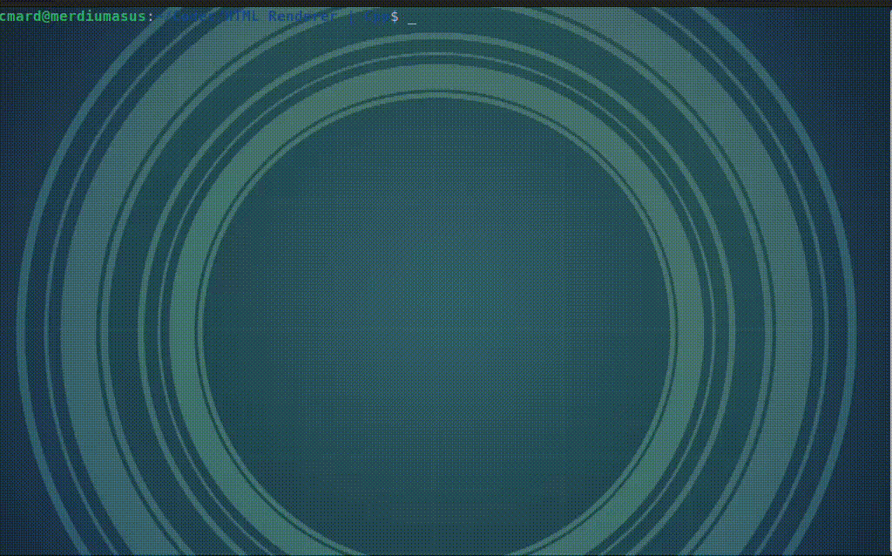
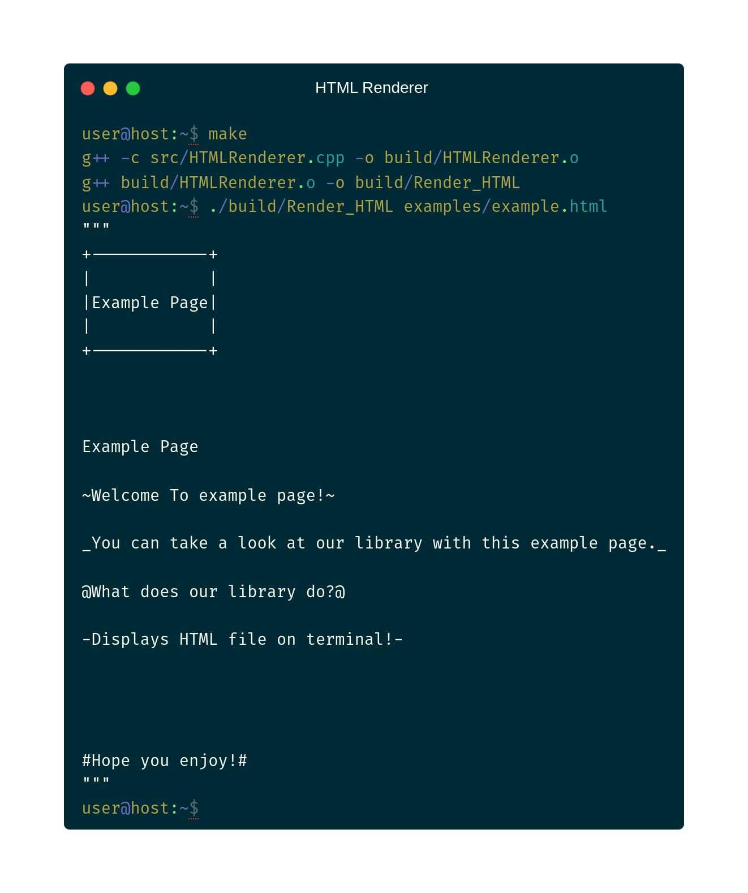
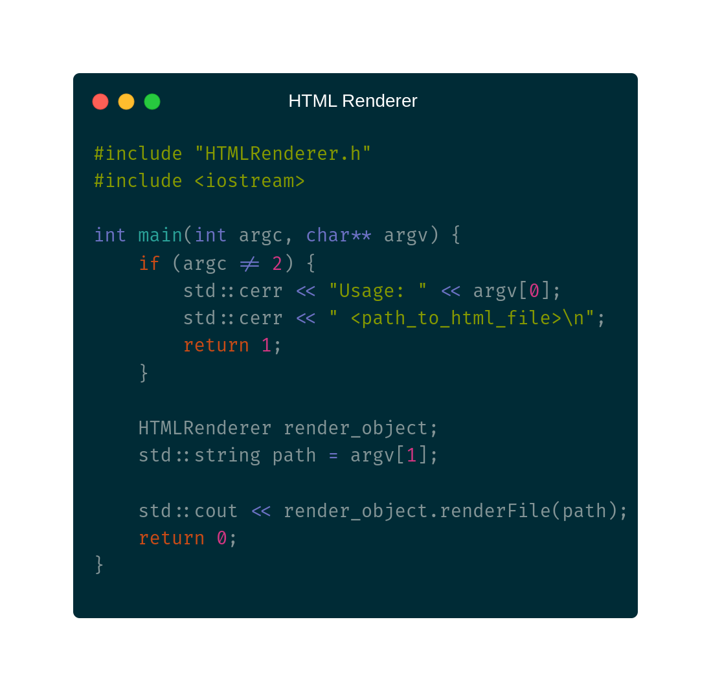
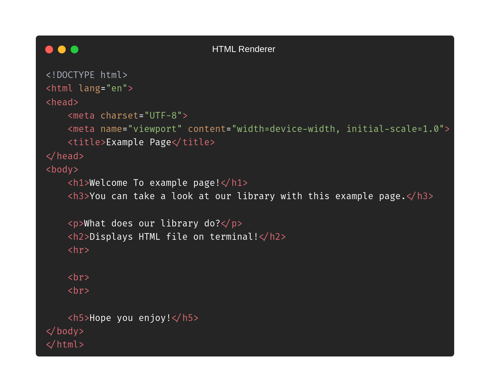

 

<h3>A simple HTML renderer, that let's you to view any webpage in your terminal.</h3>

<h2>Installation</h2>
<h4>First, install <a href='https://github.com/cMardc/Customizable-Console/tree/main'>Customizable Console Library</a>.</h4>
<h4>Then, install our <a href='https://github.com/cMardc/HTML_Renderer/tree/main'>own library</a></h4>

<h2>Use cases</h2>
<ul>
    <li>You are on repair mode, and don't have acces to GUI.</li>
    <li>You have a virtual machine (or just a default computer), on a terminal-only mode.</li>
    <li>Your browser opens late, or it's slow or it doesn't even work.</li>
    <li>It's faster to work on terminal.</li>
</ul>

<h2>Example Codes</h2>

<h3>C++</h3>

<h3>HTML</h3>

<h3>BASH (Terminal Output)</h3>

<h3>Thanks for selecting us!</h3>
<h4>Made by ~cM</h4>
<h5>More Info: </h5>

<h5>Other links : </h5>
<a href="https://discord.gg/5W4XtHkc6g">Discord</a>
<a href="https://github.com/cMardc">Github</a>
<a href="https://stackoverflow.com/users/21458468/merd-ceferzade">Stack Overflow</a>

